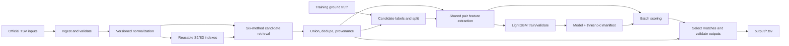
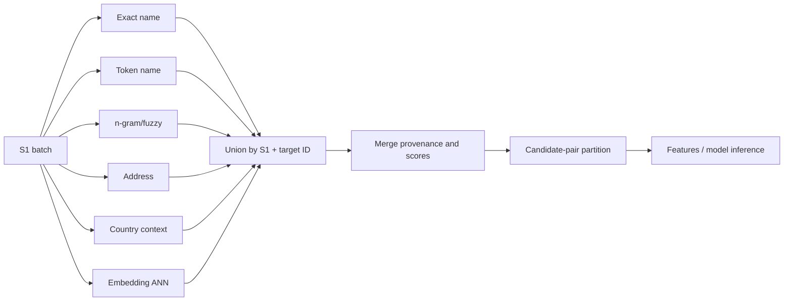
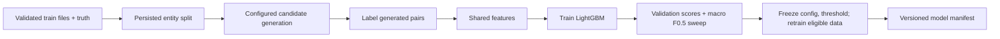
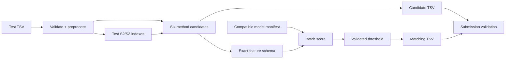
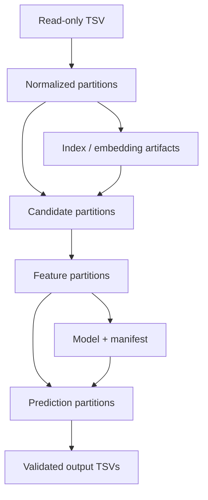

# Technical Design — ML Challenge Entity Resolution System

## 1. Document Control

| Field | Value |
|---|---|
| Version / status | 0.2 / Draft — revised pending fresh audit |
| Created | 2026-09-26 |
| Requirements baseline | `SRS-BL-1.0` (`docs/SRS.md` v1.0) |
| Architecture authority | `docs/design_freeze.md`; its six method-family decisions are binding |
| Scope | Implementation blueprint for the Business Entity Resolution Challenge |
| Audience | Implementers, reviewers, testers, and maintainers |

This design translates approved requirements into components, contracts, and verification work. It does not approve itself, modify the baseline, or select experimental parameters. `problem_statement.md` remains authoritative for challenge rules and submission contracts.

| Version | Date | Status | Change |
|---|---|---|---|
| 0.1 | 2026-09-26 | Draft | Initial implementation-oriented design and traceability companion |
| 0.2 | 2026-09-26 | Draft | Resolves audit findings F-01–F-07; no baseline change |

## 2. Purpose, Scope, and Design Principles

The system resolves each Source 1 (S1) business against zero, one, or many Source 2 (S2) and Source 3 (S3) businesses. It must retain singleton S1 records and must not impose one-to-one assignment. Training learns pair acceptance from labelled training records; inference applies the frozen configuration to unlabelled test records.

Requirements specify *what* must hold. This document specifies *how* components cooperate. **Frozen** means an approved architectural commitment. **Proposed** means a reviewable implementation convention. **Open** means validation or approval is still required.

Frozen principles are: six independent candidate-retrieval families with union semantics; six feature groups and a shared schema; LightGBM binary pair classification; entity-level validation and validation-selected threshold; a single-workstation, disk-backed batch pipeline; and independent candidate-recall evaluation. Source data are read-only, external identity lookups/geocoding are prohibited, and test labels never influence development.

## 3. System Context and Overall Architecture

Inputs are official train/test TSVs and, only for training/evaluation, ground truth. Outputs are the two required TSVs. Shared preprocessing, target indexes, candidate representation, feature schema, and artifact manifest prevent training/inference drift.

Responsibilities: ingestion validates and fingerprints inputs; normalization preserves raw fields and derives comparison views; index builders materialize S2/S3 retrieval indexes; retrieval emits pair evidence; union owns eligibility and provenance; feature extraction creates typed model inputs; training owns labels/splits/experiments; inference owns compatibility checks, scoring, selection and outputs. Index and schema manifests are dependencies, not optional metadata.

## 4. Data Model and Data Contracts

All TSV inputs are decoded as UTF-8 before parsing. Raw business records use only established fields: `entity_id`, `business_name`, `business_address`, and `country`, plus internal `source` (`S1`, `S2`, or `S3`) and immutable input ordinal. IDs are non-null, unique within a source, and prefix-consistent; source plus ID is the pair key. Original decoded values are retained unchanged. Normalized fields are separate nullable strings; missing is null/absent, never an empty-string match signal.

| Contract | Required representation |
|---|---|
| Ground truth | `source1_entity_id`, comma-separated `matched_entity_ids`; parsed to a set, preserving empty lists |
| Candidate pair | `s1_id`, `candidate_id`, `candidate_source`, `source_pair`, retrieval-method set, method evidence, config/index versions, batch and input lineage |
| Feature row | pair key, schema version, typed feature columns, source-pair indicator, missing/comparability states, lineage |
| Prediction | pair key, model version, schema/config hashes, probability, decision result |
| Final result | S1 ID plus ordered, unique permitted S2/S3 IDs; all test S1 IDs represented |

Candidate provenance is additive: a candidate found by several methods has one pair row and all method flags/scores. Pair records retain raw-record fingerprints and normalization/index/config versions so no result is detached from its inputs.

## 5. Data Ingestion and Preprocessing Architecture

Discovery resolves configured relative paths, checks existence/readability, decodes TSV input as UTF-8, parses headers, validates row shape, IDs, source membership, duplicates and ground-truth references, and emits a validation report. UTF-8 decoding failures, unreadable files, missing/incorrect headers, structural TSV failures, and invalid required identifiers are blocking input errors: no downstream artifact is created from that input. Missing, malformed, or unusable optional business attributes are recoverable data-quality issues only when they can be represented as flagged missing/non-comparable evidence; they are not matching evidence. Original decoded values and source files are never rewritten. A content fingerprint, row count, encoding, schema, validation status, and error/warning counts form input metadata.

**Frozen principles:** preserve raw data; accommodate formatting, abbreviation, language, transliteration, incomplete values, and open-ended country values; do not let missing fields imply agreement. **Open algorithms:** Unicode/case/punctuation handling, suffix policy, tokenization, transliteration, address parsing, country canonicalization, and malformed-value remediation. They belong in a versioned preprocessing configuration and must be executed identically for train and test.

Proposed normalized dataset partitions store raw fields, normalized name/address/country views, token arrays where selected, quality flags, source and ordinal. Country is retrieval context, not a mandatory equality constraint. Normalized partitions are disk-backed and reusable only when their input and preprocessing fingerprints match.

## 6. Candidate Generation Architecture

### 6.1 Overview

For deterministic S1 batches, query independently built S2 and S3 indexes using six families, union returned target IDs, deduplicate on `(s1_id, candidate_id)`, retain every method’s evidence, and write partitioned candidate pairs. The exact same configured pipeline runs before training labels and at test time. Candidate recall, volume, reduction ratio and incremental contribution are evaluated separately from the classifier.

### 6.2 Exact and normalized-name blocking

Build raw- and normalized-name inverted indexes per target source; lookup corresponding S1 representations and emit equality-key provenance. Normalization rules, key variants, collision handling, and retrieval limits remain open configuration.

### 6.3 Token-based name retrieval

Build a token/postings or lexical retrieval index over selected name tokens; query S1 tokens and retain ranked hits with evidence. Tokenizer, weighting/ranking, stop/common-token policy, and limits remain open configuration.

### 6.4 Character n-gram and fuzzy-name retrieval

Persist an n-gram representation/index or approximate-similarity retrieval structure; query S1 names and emit ranked approximate hits. N-grams, similarity algorithm, threshold, and top-k remain open configuration.

### 6.5 Address-based retrieval

Independently retrieve through normalized-address equality, token, fuzzy, and reliable component indexes. Address hits create candidates and never operate as a universal hard filter. Parsers, components, similarities, and limits remain open configuration.

### 6.6 Country-aware retrieval

Partition, prioritize, or annotate searches with country context, while issuing the configured fallback retrieval when country is missing, inconsistent, or different. Country normalization and fallback policy remain open configuration; country equality is not a universal hard filter.

### 6.7 Embedding-based nearest-neighbor retrieval

Generate versioned name-focused and name-plus-address representations, store vectors plus record mapping, and query versioned nearest-neighbor indexes. The embedding model/license, index implementation, metric, k, and thresholds remain open configuration.

Method 6 cannot use an external business-identity service. Any model must satisfy the challenge model-license/size conditions where applicable. Index manifests identify target data fingerprint, preprocessing version, method configuration, vector/model version (if any), and build date; mismatch forces rebuild.

### 6.8 Union, eligibility, and deduplication

The union service validates S2/S3 origin, groups by S1 and target ID, merges method evidence without overwriting it, and does not veto a method’s candidate because another method disagrees. Empty candidate sets remain explicit. Ground-truth labels are never injected. Candidate eligibility is the union of configured method returns after integrity validation only.

### 6.9 Candidate budgets and retrieval configuration

Each method has versioned retrieval parameters and optional per-query limits. Any overall budget is an **open, validation-selected** safety control, not an arbitrary global cap. Tuning must report its effect on recall, volume, resource use and per-method incremental positives.

For every batch, the candidate-generation run report records retrieval method, source pair, query/batch ID, configuration hash, configured per-method limit and candidate budget (if enabled), pre-limit retrieved count, post-limit retained count, union/deduplication count, integrity-rejection count, final scored count, method provenance and score availability. A candidate removed after retrieval has a reason code distinguishing configured limit/budget trimming, duplicate collapse, invalid source/ID/integrity rejection, or other validated exclusion. The report is an audit artifact, not a second eligibility filter.

### 6.10 Candidate-generation outputs and evaluation

For labelled data report macro per-S1 candidate recall, true-match misses, total/mean/distribution of pairs, reduction ratio against S1×(S2+S3), source pair/country/match-count slices, and method contribution including incremental discoveries. The report separates pre-limit retrieval, post-limit union, integrity rejection, and scored-pair counts. Candidate output is the final union actually sent to feature scoring, not an early retrieval stage.

## 7. Pairwise Feature Extraction Architecture

### 7.1 Feature extraction overview

Feature extraction joins candidate pairs to normalized records, computes a single typed row per pair, and never creates pairs.

### 7.2 Business-name features

Use raw/normalized names and tokens for exact, token/character/semantic similarity, length, and comparability signals.

### 7.3 Address features

Use raw/normalized addresses and selected components for equality, overlap, approximate similarity, component agreement, and comparability signals.

### 7.4 Country and geographic features

Use raw/normalized country and reliable address context for agreement, disagreement, missing, and unknown/open-country indicators.

### 7.5 Cross-field interaction features

Represent name/address/country evidence together through agreement-pattern and conflict/context categories, not hand-set weights.

### 7.6 Candidate-generation evidence features

Represent retrieval method flags/count, method-specific score presence/value/state, source-pair, and the audited retrieval path.

### 7.7 Data-quality and context features

Represent null/malformed/short/genericness indicators where validated, field lengths, source-pair, and retrieval context.

Exact formulas, feature names, generic-name definitions and numeric encoding are **pending specification**. For every comparable field the schema separates available agreement, available disagreement, missing/unavailable, and not reliably comparable. Missing does not equal disagreement or match.

### 7.8 Feature schema and data types

A feature-schema manifest fixes ordered names, types, nullable policy, producer version and preprocessing dependency. The model artifact records its exact schema hash.

### 7.9 Training and inference consistency

Training and inference invoke the same feature library and fail on absent, reordered, or type-incompatible columns.

### 7.10 Feature storage and validation

Proposed storage is partitioned columnar files keyed by dataset/split, source pair and deterministic S1 batch, with pair IDs/config hashes retained for lineage; format/compression are open benchmark choices. Validate uniqueness of pair keys, row-to-candidate correspondence, allowed types/ranges, schema hash, and no unaccounted null coercion.

## 8. Training Data Construction and Labeling

Validate ground truth against training source IDs, generate candidates without labels, then label a generated pair positive exactly when candidate ID appears in that S1 ground-truth set; otherwise label it negative. Retain all generated positives. Ground-truth positives absent from candidates are recorded in a candidate-miss report and never injected.

Create and persist a deterministic entity-level S1 train/validation split before training; validation S1 labels/rows do not participate in training or hard-negative mining. The SRS records a 90/10 default, but any split strategy details beyond approved entity-level separation/stratification are experimental configuration. Negatives may include training-only hard negatives and representative ordinary negatives; their ratio, criteria, weighting, and sampling seed are open and recorded. Store labels, sampling provenance, split ID, candidate config and feature schema with the training dataset.

## 9. Model Architecture and Training Pipeline

### 9.1 Model architecture

**Frozen:** LightGBM is the primary binary classifier. It consumes the shared feature matrix and returns a pairwise probability/confidence. Model artifact metadata binds model binary, ordered feature schema hash, preprocessing/candidate configurations, training dataset/split fingerprints, seed, metrics and selected threshold. XGBoost is a controlled challenger only; CatBoost may only be investigated if approved design evidence authorizes it—no ensemble is designed here.

### 9.2 Training workflow

1. Validate training inputs and immutable split.
2. Build/reuse compatible indexes; generate/measure candidates.
3. Construct labels and sampled training examples.
4. Generate validated features.
5. Train LightGBM and score held-out S1 entities.
6. Compute official macro F0.5 using an evaluator confirmed against challenge behavior; sweep candidate thresholds and assess local stability.
7. Select a documented global threshold unless a controlled validation experiment justifies source-pair thresholds.
8. Freeze selected configurations and retrain on all eligible training data; preserve the validation-selection record.

### 9.3 Model alternatives

XGBoost is a controlled challenger only. CatBoost may be considered for controlled comparison as allowed by `design_freeze.md`; no ensemble is designed here. The primary architecture remains LightGBM unless a change is justified by experiment and approved.

### 9.4 Threshold selection

The final numeric threshold, hyperparameters, loss/regularization, early stopping and challenger outcome are open until measured. Test data and labels are never tuning inputs.

## 10. System Architecture and Resource Management

The approved primary mode is a single workstation, batch-oriented and disk-backed; a secondary laptop is supporting only. The documented hardware establishes capacity context, not a performance guarantee or final resource setting.

### 10.1 Execution environment

| Environment | Verified specification | Intended role |
|---|---|---|
| Primary workstation | Windows; Intel Xeon w7-2575X; 22 physical cores / 44 logical threads; 128 GB RAM; NVIDIA RTX 4000 Ada Generation with 20 GB VRAM; CUDA 13.2; 2 TB SSD; approximately 336 GB currently free | Full pipeline execution |
| Secondary laptop | NVIDIA RTX 3050 with 4 GB VRAM; other specifications not established | Development, small tests, monitoring, and analysis only |

The approximately 336 GB free-space figure is an observation from `design_freeze.md`, not a reservation. Before each material run, recheck usable space on the actual input/work volumes. Windows, Python/dependency versions, GPU drivers, CUDA-dependent libraries, and CPU/GPU execution modes require compatibility verification; CUDA availability is not inferred merely from the recorded CUDA version.

### 10.2 Processing architecture

Deterministic S1 batch IDs derive from input partition, ordinal range and config hash. S2/S3 indexes are reusable/versioned. Candidate, feature and score partitions stream to disk; only working batches are resident.

### 10.3 CPU and GPU responsibilities

CPU is the default for parsing, indexing, joins, validation and LightGBM-compatible work. GPU acceleration is optional for compatible embedding, nearest-neighbor, or LightGBM work only after compatibility, determinism, memory-use, and performance benchmarking. Batch size, workers, file format/compression and accelerator usage are open.

### 10.4 Memory and storage management

Before full-scale execution, use representative partitions to estimate normalized-record, index, embedding, candidate, feature, checkpoint, temporary-write, and final-output sizes; calculate peak concurrent space, reserve recovery/output headroom, and compare it with rechecked available SSD space. Monitor disk, RAM, and relevant VRAM during execution; stop cleanly on insufficient capacity and never delete raw input. Disposable artifacts may be cleaned only after dependency/manifests and final deliverables are validated.

### 10.5 Checkpointing and recovery

Each completed partition uses write-to-temporary, validate, atomic rename, and a manifest containing row counts, pair/ID uniqueness checks, checksums, config/schema/index dependencies and status. Resume scans manifests: compatible complete batches are reused; incomplete/corrupt/incompatible batches are recomputed, never appended blindly. Final TSVs are built in a staging location and atomically promoted only after validation.

### 10.6 Configuration and environment management

Central configuration contains relative paths, versions, selected retrieval/feature/model settings, seeds and resource settings. Pin dependencies; log software/hardware metadata, commands, timestamps, warnings and hashes. Fixed seeds are used where supported; nondeterminism is disclosed rather than claiming bit-for-bit reproducibility.

## 11. Inference and Prediction Pipeline

### 11.1 Input validation

1. Validate test schemas, IDs, source membership and input metadata.
2. Load the selected manifest and reject missing/incompatible model, schema, preprocessing, candidate config, threshold or indexes; do not substitute defaults.

### 11.2 Preprocessing and indexing

3. Apply the training-compatible preprocessing; build/reuse test S2/S3 indexes.

### 11.3 Candidate generation

4. Generate, union and persist the six-family candidate set in deterministic batches.

### 11.4 Feature extraction and scoring

5. Extract the exact feature schema, score each pair in batches, retaining pair association.

### 11.5 Match selection

6. Accept each score satisfying the selected policy. Retain all accepted candidates: no one-to-one matching and no maximum match count.

### 11.6 Output generation

7. Assemble all S1 rows in original test S1 order and validate/write outputs.

`output/matching_results.tsv` has exactly `source1_entity_id` and `matched_entity_ids`; `output/candidate_pairs.tsv` has exactly `source1_entity_id` and `candidate_entity_ids`. Both have one row per test S1, empty field for empty lists, comma-separated unique S2/S3 IDs only, and original S1 order. Every match must be in the actual scored candidate set; a violation is reported and investigated. Run the official `utils/validate_submission.py` when provided; blocking validation failures prevent promotion.

### 11.7 Final submission-package verification

In addition to the two validated output TSVs, package assembly verifies the official final-submission structure: runnable source under `code/business_entity_resolution/src/`, a `README.md` with end-to-end reproducible instructions, a pinned dependency declaration such as `requirements.txt` or equivalent environment specification, and completed methodology documentation using `Documentation_template.md`. A package manifest records required paths and a completeness check verifies their presence before archive creation. This is a packaging check; it does not add requirements beyond the challenge statement.

## 12. Evaluation and Experiment Management

Official primary quality is macro F0.5, calculated per S1 including singletons, subject to confirmation of evaluator edge behavior. Supporting measures are precision, recall, PR-AUC, candidate recall, pair volume/reduction ratio, runtime, peak memory and disk use. Candidate evaluation is sliced by source pair, country (including open/unseen values), match count, retrieval method and incremental contribution.

Error analysis separates candidate misses from model-ranking/feature errors and threshold errors. Aggregate false positives for ambiguous/generic names, shared addresses and conflicts; inspect false negatives by the same categories. Each experiment has a unique ID, objective/hypothesis, one major change where practical, stable split/evaluator, fingerprints, configs, schema/model/threshold, sampling, metrics, resource use, seeds, software and artifact paths. Final model selection compares controlled experiments and is followed by the specified retraining; test data are excluded.

## 13. Artifact and Storage Architecture

Proposed relative layout (not a mandated existing layout):

| Artifact | Proposed location | Lifecycle and dependencies |
|---|---|---|
| Input validation/fingerprints | `artifacts/inputs/` | immutable per input version |
| Normalized partitions | `artifacts/normalized/<dataset>/<preproc-hash>/` | rebuild on input/preprocessing change |
| Target indexes/embeddings | `artifacts/indexes/<source>/<index-hash>/` | reusable only with matching target/preprocessing config |
| Candidates/features/scores | `artifacts/runs/<run-id>/batches/` | partitioned, checkpointed, lineage-bound |
| Candidate-generation run reports | `artifacts/runs/<run-id>/candidate_reports/` | per-batch pre/post-limit, provenance, exclusion-reason and scored-count audit trail |
| Splits/labels/samples | `artifacts/experiments/<id>/data/` | immutable experiment inputs |
| Models/manifests/reports | `artifacts/experiments/<id>/` | versioned selection evidence |
| Final outputs | `output/` | atomic after validation |
| Submission package manifest | `artifacts/submissions/<submission-id>/` | verifies output, runnable-code, README, dependency, and methodology-template completeness before archive |

Artifact manifests declare purpose, producer/version, hashes, dependencies, status and retention. Source data are outside cleanup scope.

## 14. Error Handling and Operational Reliability

Schema/ID/source/ground-truth failures are explicit input errors; malformed optional attributes become flagged missing/non-comparable evidence, not matches. Incompatible model/index/schema/config manifests fail before processing. Resource exhaustion stops the current batch with diagnostic measurements and leaves only validated checkpoints. Interrupted work resumes only from compatible manifests. Corruption, duplicate pair rows, checksum/row-count mismatch, or output validation failure quarantines the artifact and requires recomputation. Structured logs include run/batch IDs, severity, config hashes and actionable cause; no unapproved recovery guarantee is asserted.

## 15. Security, Data Integrity, and Reproducibility

Operate on source files read-only; restrict artifact mutation to controlled runs; use manifests/checksums and atomic writes for lineage. Do not call external databases, APIs, geocoders or identity services. Version inputs, configs, normalizers, indexes, schemas, model and threshold together. Preserve experiments and record supported random seeds/nondeterministic operations. Validate artifact compatibility before reuse.

## 16. Requirements Traceability Summary

The companion [requirements traceability matrix](REQUIREMENTS_TRACEABILITY.md) maps the 213 distinct functional-requirement IDs extracted from `docs/SRS.md` to this design and a planned verification method. Baseline and reconciliation documents report no unresolved frozen-design coverage gap. Requirement changes follow `SRS_BASELINE.md` change control; this design does not alter requirements.

## 17. Open Technical Decisions

| Decision | Why / constraints | Required evidence and owner |
|---|---|---|
| Normalization, tokenization, address/country parsing | Must preserve raw data, generalize to France/mixed scripts, and avoid hard country exclusion | Controlled candidate/model experiments; technical-design review |
| Retrieval libraries/indexes, ANN model/metric, per-method limits | Six families are frozen; implementations/limits are not | Candidate recall/volume/resource benchmark; review; license check |
| Candidate budget | Cannot be arbitrary global cap | Validation trade-off report; review |
| Exact feature formulas/encodings | Six groups/schema consistency frozen | Feature ablation and schema specification; review |
| Negative sampling and split details | All positives retained; no leakage | Training-only experiment record; review |
| LightGBM settings and final threshold | Threshold must maximize validation macro F0.5 | Controlled validation/sweep and stability record; model-selection review |
| Batch/workers/storage/compression/GPU | Must fit observed workstation capacity, no invented limit | Hardware inventory and benchmark; operations review |

## 18. Implementation and Verification Sequence

| Phase | Inputs / outputs | Dependencies and verification |
|---|---|---|
| 1. Foundation | configs, environment, manifests | paths/dependencies/seeds/logging reproducible |
| 2. Ingest/preprocess | TSV → validated normalized partitions | schema/ID reports; raw preservation |
| 3. Index/retrieval | normalized targets/S1 → candidates | six methods, union/provenance, candidate metrics |
| 4. Features/labels | candidates/truth → schema-valid matrices | pair lineage, missingness semantics, no injected positives |
| 5. Train/validate | split/features → selected model/threshold | leakage checks, macro F0.5 and stability |
| 6. Inference/output | test/model manifest → TSVs | compatibility, row/order/list/subset checks and official validator |
| 7. Package verification | outputs/code/docs → final package manifest | required paths, reproducible instructions, dependency declaration, methodology template |
| 8. Reliability | artifacts/run records | interrupted-run resume, corruption/resource failure tests |

## 19. Risks, Constraints, and Trade-offs

Established constraints: ten-million-plus target-scale training data, open-country test distribution including France, multi-match and singleton outcomes, precision-weighted F0.5, no external lookup, required candidate output, and single-workstation batch architecture. Risks: candidate misses cap recall; broad retrieval causes candidate explosion; noisy/incomplete labels/attributes cause ambiguous pairs; indexes/embeddings create storage and compute pressure; thresholding trades recall for precision; and weak manifests make recovery irreproducible. Mitigate through independently measured candidate recall, disk-backed partitions/checkpoints, controlled experiments, compatibility manifests, error slicing and validation—without performance guarantees.

## 20. Glossary and References

**Candidate pair:** an S1–S2/S3 pair admitted by the union. **Candidate recall:** fraction of known matches present in that set. **Feature schema:** ordered, versioned model-input contract. **Singleton:** S1 with no accepted/true target match. **Provenance:** methods/evidence that retrieved a candidate. **Macro F0.5:** per-S1 precision-weighted score averaged across S1 records.

References: `docs/problem_statement.md` (official contract), `docs/SRS.md` and `docs/SRS_BASELINE.md` (baseline/change control), `docs/design_freeze.md` (frozen architecture), `docs/knowledge.md` (authoritative project knowledge), `useful/knowledge.md` (supporting dataset context), `docs/SRS_REVISION_SUMMARY.md`, `docs/SRS_RECONCILIATION_REPORT.md`, and `reports/dataset_analysis/`.
